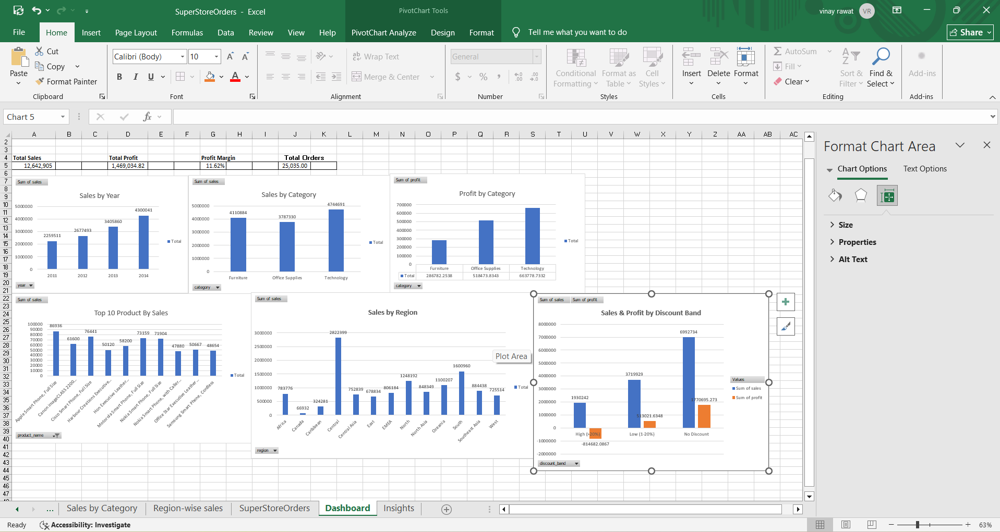

# 📊 Superstore Sales & Profit Analysis

An end-to-end sales and profitability analysis project built using **Excel, Power Query, PivotTables, Dashboarding, and SQLite SQL**.

## Project Overview

This project analyzes Superstore sales data to identify sales trends, category performance, regional performance, customer contribution, and the impact of discounts on profitability.

## Tools & Technologies

- Microsoft Excel
- Power Query
- PivotTables & PivotCharts
- SQLite
- SQL
- GitHub

## Key KPIs

- **Total Sales:** 12,642,905
- **Total Profit:** 1,469,035
- **Overall Profit Margin:** 11.62%
- **Total Orders:** 25,035

## Analysis Performed

### Excel Analysis

- Data cleaning and transformation using Power Query
- Date and numeric data type correction
- Profit Margin calculation
- Discount Band classification
- Sales and profit analysis by:
  - Region
  - Category
  - Year
  - Segment
  - Discount Band
- Top 10 products by sales
- Excel dashboard
- Business insights sheet

### SQL Analysis

SQLite queries were used to analyze:

1. Region-wise sales and profit
2. Category-wise sales and profit
3. Discount impact on profitability
4. Top 10 customers by sales
5. Year-wise sales and profit trends

## Key Insights

- Sales increased consistently from 2011 to 2014, with 2014 recording the highest annual sales.
- Technology generated the highest profit among the three product categories.
- Central region recorded the highest sales among the regions, while Canada recorded the lowest.
- High discounts (>20%) were associated with negative overall profit.
- No-discount orders generated the highest overall profit.

## Business Recommendations

- Revisit discounting strategies above 20% due to their negative impact on overall profit.
- Focus inventory and marketing efforts on Technology, which generated the highest total profit.
- Investigate lower-performing regions such as Canada to identify opportunities for improving sales.

## Dashboard



## Project Files

| File | Description |
|---|---|
| `Superstore_Sales_Dashboard.xlsx` | Complete Excel analysis, dashboard and insights |
| `queries.sql` | SQLite SQL analysis queries |
| `dashboard_screenshot.png` | Dashboard preview |

## Project Workflow

```text
Raw Superstore Data
        ↓
Power Query Cleaning
        ↓
Excel Analysis & Calculated Columns
        ↓
PivotTables & PivotCharts
        ↓
Dashboard & Business Insights
        ↓
SQLite SQL Analysis
        ↓
GitHub Documentation
```

## Dataset

This project uses the [Superstore Sales Dataset](https://www.kaggle.com/datasets/laibaanwer/superstore-sales-dataset) (Kaggle). The raw dataset is not included in this repository.
